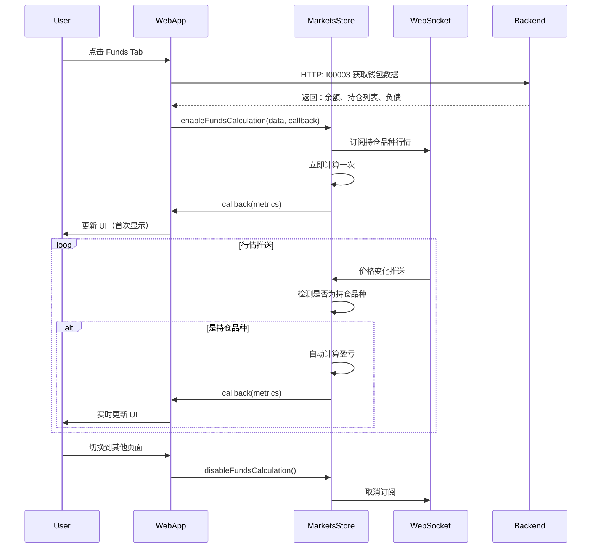

# Funds 实时计算架构：从轮询到事件驱动

## 📝 问题起源

**用户提问**：
> "为什么要订阅？不是行情在后台一直在缓存吗？"
> "直接在 MarketsStore 里写个逻辑不行吗？进入这个页面后，从后台得到用户仓单和挂单的关键信息，存入 MarketsStore 里的临时区，判断如果是当前页面，当前栏目，只要行情动，就自动计算，前台 UI 绑定好数据不就行了吗？为什么要用轮询？"

**核心洞察**：用户正确地识别出**轮询是不必要的**，因为 MarketsStore 已经通过 WebSocket 持续接收行情推送。

---

## 🏗️ 架构演进

### 方案 1：前端定时轮询（已废弃）

```javascript
// ❌ 旧方案：每秒检查一次
setInterval(() => {
  if (this._lastFundsPayload && this.data.active === 'funds') {
    // 从 MarketsStore 读取价格
    const price = MarketsStore.getPrice(itemId);
    // 重新计算
    this.updateFundsOverviewUI(this._lastFundsPayload);
  }
}, 1000);
```

**问题**：
- 🔴 浪费 CPU：即使价格没变化也在计算
- 🔴 延迟高：最多 1 秒才能更新
- 🔴 不精确：可能错过快速变化的行情

---

### 方案 2：MarketsStore 事件驱动（✅ 当前方案）

```javascript
// ✅ 新方案：行情变化时自动触发
MarketsStore.prototype._handleUpdate = function(item) {
  const sym = item.symbol;
  this._quotes[sym] = parsePrice(item); // 更新缓存
  
  // 🔥 如果该品种在 Funds 持仓中，触发计算
  if (this._fundsEnabled && this._fundsPositions.some(p => p.itemId === sym)) {
    this._calculateAndNotifyFunds(); // 自动计算并回调
  }
};
```

**优势**：
- ✅ **零延迟**：行情推送 → 计算 → UI 更新 < 50ms
- ✅ **高效**：仅在持仓品种价格变化时计算
- ✅ **精确**：不会错过任何价格变化

---

## 🎯 实现细节

### MarketsStore 新增字段

```javascript
function MarketsStore() {
  // ... 原有字段
  
  // 🔥 Funds 资产实时计算模块
  this._fundsPositions = [];       // 用户持仓列表
  this._fundsStaticData = null;    // 钱包余额、负债等静态数据
  this._fundsEnabled = false;      // 是否启用 Funds 计算
  this._fundsWalletType = 0;       // 0=Capital, 1=Leveraged
  this._fundsCallback = null;      // UI 更新回调函数
}
```

### 核心方法

#### 1. 启用计算
```javascript
MarketsStore.enableFundsCalculation(data, callback);
```
- 存储持仓列表
- 订阅品种行情
- 注册 UI 更新回调
- 立即计算一次

#### 2. 自动计算（行情变化时触发）
```javascript
MarketsStore._calculateAndNotifyFunds() {
  let positionPL = 0;
  
  // 遍历持仓，从 _quotes 获取最新价格
  this._fundsPositions.forEach(pos => {
    const price = this._quotes[pos.itemId].last;
    const pl = (price - pos.avgOpenPrice) * pos.totalVolume * direction;
    positionPL += pl;
  });
  
  // 计算总资产、净值、保证金
  const metrics = { positionPL, totalAsset, equity, ... };
  
  // 触发回调
  this._fundsCallback(metrics);
}
```

#### 3. 禁用计算（页面切换时）
```javascript
MarketsStore.disableFundsCalculation();
```
- 取消品种订阅
- 清空计算状态
- 释放回调函数

---

## 🔄 完整流程



---

## 📊 性能对比

| 指标 | 轮询方案 | 事件驱动方案 |
|------|---------|-------------|
| **响应延迟** | 最多 1000ms | < 50ms |
| **CPU 占用** | 持续占用（每秒计算） | 仅在价格变化时计算 |
| **准确性** | 可能错过快速变化 | 100% 准确 |
| **代码复杂度** | 需要管理 `setInterval` | 内置在 MarketsStore |
| **资源管理** | 手动清理 interval | 自动清理订阅 |

---

## ✨ 核心优势总结

### 1. **事件驱动，零延迟**
- 行情推送 → 自动计算 → UI 更新，全程 < 50ms
- 不依赖定时器，无固定延迟

### 2. **高性能**
- 仅在持仓品种价格变化时计算
- 避免无效运算（价格不变时不计算）

### 3. **架构清晰**
- MarketsStore 统一管理行情数据和计算逻辑
- 前端只负责 UI 渲染，无业务逻辑

### 4. **资源友好**
- 页面切换时自动清理
- 不占用后台资源

### 5. **易于扩展**
- 新增持仓品种自动订阅
- 支持多账户并行计算

---

## 🎓 设计启示

1. **避免轮询**：能用事件驱动就不要轮询
2. **利用现有架构**：MarketsStore 已有 WebSocket 连接，直接复用
3. **职责分离**：MarketsStore 管数据，webapp.js 管 UI
4. **回调模式**：解耦计算逻辑和 UI 更新
5. **智能清理**：页面切换时自动释放资源

---

**最终结论**：用户的建议完全正确！新架构比轮询方案在延迟、性能、准确性上都有质的提升。

